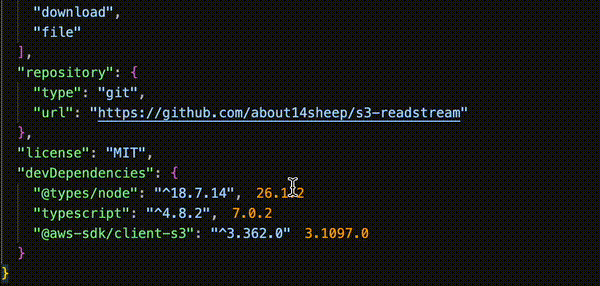

# tinyNpm

**Security-focused package.json version keeper VS Code extension**
tinyNpm helps prevent your application from being impacted by supply chain attacks. Most package.json version keepers just show the absolute latest version of a package, tinyNpm allows a configurable buffer period greatly decreasing the chances of download malicious versions.

It does this and so much more!

## Features

### Package version buffer period

Most supply chain attacks are actually resolved very quickly by npm. However since so many devs update their packages as soon as a new version is available its hard to completely prevent malicious versions from spreading.

tinyNpm allows you to avoid all that by giving a buffer period (in days) before showing you the newest version.

It also removes modifiers from the version (i.e. `^`) so you know exactly what version you are using.

### Inline version info + one-click updates

Hovering over a dependency's version in `package.json` shows the latest published version alongside a **buffered** version — the newest release that's been out for at least a configurable number of days. Newly published versions are a common vector for supply-chain attacks (a compromised maintainer account can publish a malicious version that gets pulled by anyone who updates immediately), so the buffered suggestion gives you a safer default.

From the hover you can:
- Update to the buffered (safer) version with one click
- Update to the absolute latest version with one click
- Jump straight to the `tinynpm.versionBufferPeriod` setting to adjust the buffer window

Hovering over the update buttons shows the version and its publish date

### Package details on hover

As well as versioning we show a security breakdown of the package in the hover menu:
- ✅/⚠️/❌ **dependency count** — flags packages with a large transitive dependency tree (more dependencies = more surface area)
- 🆕/⏰/💀 **staleness** — flags versions that haven't been updated in a while (180+ days gets a warning, 2+ years gets flagged)
- 🔥/📉/🦙 **weekly download count** — flags packages with low adoption, since less-used packages get less community security scrutiny
- Quick links to the package's repository and homepage
- Quick link to the package's socket.dev page for more security analysis

### Private registry support

tinyNpm reads your project's `.npmrc` so scoped packages pointed at a private registry are resolved correctly instead of erroring out or silently falling back to the public registry.

### Zero external runtime dependencies

Aside from `semver` for version comparisons, tinyNpm doesn't pull in any third-party packages — smaller install footprint, smaller attack surface, faster startup.

## Requirements

None — tinyNpm activates automatically and works with any project that has a `package.json`.

## Extension Settings

This extension contributes the following setting:

- `tinynpm.versionBufferPeriod`: Minimum age, in days, before a published version is considered "safe" and used as the buffered update suggestion. Default: `3`.

## Known Issues

None currently tracked. If you run into a bug, please [open an issue](https://github.com/about14sheep/tinyNpm/issues).

## Release Notes

See [CHANGELOG.md](./CHANGELOG.md) for a full history.

---

**Contributions and issues welcome** — see the [GitHub repository](https://github.com/about14sheep/tinyNpm).
